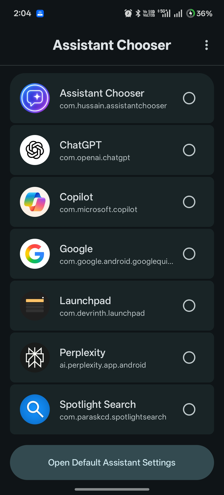

# Assistant Chooser

<p align="center">
  
</p>

<p align="center">
  
  
  
</p>

<p align="center">
    <a href="https://github.com/Ayaanh001/Assistant-Chooser/releases">
        
    </a>
    <a href="https://github.com/">
        
    </a>
</p>

# 📱 Assistant Chooser

**Assistant Chooser** is an Android application that allows users to easily set and manage their **default assistant app**.  
You can view, launch, and switch between all available assistants directly from the app.

It also provides **quick shortcuts** and **Quick Settings tiles** for faster access to assistant-related actions.
---

## 🚀 Features

- 🧭 Quickly set the app as the **default assistant**
- 🔄 Switch between assistants like **Gemini**, **ChatGPT**, **Perplexity**, and other search/AI apps
- 🎙️ Choose whether to open the **full app** or its **voice assistant**
- 🤖 Access all AI apps with voice assistants from one place
- ⚡ **Quick Settings Tile** for faster access
- 📱 Supports **Android App Shortcuts**
- 🎨 **Material You (Material 3) themed UI**
   - Dynamic color support
- 🧼 Clean and simple UI for easy navigation

---

## 🛠️ Tech Stack & Architecture

- **Language**: 100% [Kotlin](https://kotlinlang.org/)
- **UI**: [Jetpack Compose](https://developer.android.com/jetpack/compose) for a declarative and modern UI.


## 🚀 Getting Started

To get a local copy up and running, follow these simple steps.

### Prerequisites

- Android Studio Iguana | 2023.2.1 or newer.
- Android SDK 26 or newer.

### Installation

1. Clone the repo
   ```sh
   git clone https://github.com/Ayaanh001/Assistant-Chooser.git
   ```
2. Open the project in Android Studio.
3. Let Gradle sync and download the required dependencies.
4. Run the app on an emulator or a physical device.

## 📂 Project Structure

The project follows the standard Android app structure, with a few key directories:

```
Assistant-Chooser/
│
├── app/
│   ├── src/
│   │   ├── main/
│   │   │   ├── java/com/hussain/assistantchooser/   # Kotlin source files
│   │   │   ├── res/                                 # Compose resources
│   │   │   └── AndroidManifest.xml
│   └── build.gradle.kts
│
├── assets/                                          # App icons & screenshots
└── settings.gradle.kts


```
