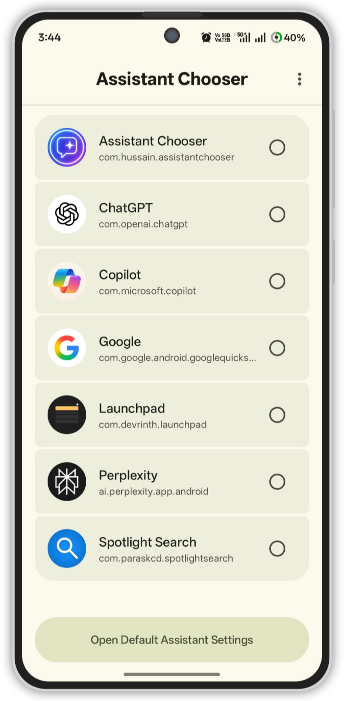

# Assistant Chooser  

**Set, switch default assistant faster and use all your assistant apps from one place.**
<p align="center">
  
</p>

<p align="center">
  
  
</p>

<p align="center">
    <a href="https://github.com/Ayaanh001/Assistant-Chooser/releases">
        
    </a>
    <a href="https://github.com/">
        
    </a>
</p>


**Assistant Chooser** allows users to easily set and manage their **default assistant app** or You can view, launch, and switch between all available assistants or search apps like [Launchpad Search](https://github.com/Ayaanh001/launchpad-search)
, [SpotLight Search](https://github.com/Ayaanh001/SpotlightSearch)   directly from the app.

It also provides **quick shortcuts** and **Quick Settings tiles** for faster access to assistant-related actions.

## 🚀 Features

- 🧭 Quickly set the app as the **default assistant**
- 🔄 Switch between assistants like **Gemini**, **ChatGPT**, **Perplexity**, and other search/AI apps
- 🎙️ Choose whether to open the **full app** or its **voice assistant**
- 🤖 Access all AI apps with voice assistants from one place
- ⚡ **Quick Settings Tile** for faster access
- 📱 Supports **Android App Shortcuts**
- 🎨 **Material You (Material 3) themed UI** with Dynamic color support
- 🧼 Clean and simple UI for easy navigation

## 🛠️ Tech Stack & Architecture

- **Language**: 100% [Kotlin](https://kotlinlang.org/)
- **UI**: [Jetpack Compose](https://developer.android.com/jetpack/compose) for a declarative and modern UI.
- **Min SDK**: Android 8.0 (API 26)


## 🚀 Getting Started

To get a local copy up and running, follow these simple steps.


### Installation

1. Clone the repo
   ```sh
   git clone https://github.com/Ayaanh001/Assistant-Chooser.git
   ```
2. Open the project in Android Studio.
3. Let Gradle sync and download the required dependencies.
4. Run the app on an emulator or a physical device.


## 📂 Project Structure

The project follows the standard Android app structure, with a few key directories:

```
Assistant-Chooser/
│
├── app/
│   ├── src/
│   │   ├── main/
│   │   │   ├── java/com/hussain/assistantchooser/   # Kotlin source files
│   │   │   ├── res/                                 # Compose resources
│   │   │   └── AndroidManifest.xml
│   └── build.gradle.kts
│
├── assets/                                          # App icons & screenshots
└── settings.gradle.kts


```

## ⚠️ Known Issues

The **Issue: Google app does not launch Gemini Assistant**
When tapping the **Google app**, some devices do **not** open the **Gemini Assistant** as expected.

✅ **Cause**
Android requires **Google** to be set as the default digital assistant in order for the Gemini Assistant to launch correctly.

✅ **Solution / Workaround (Recommended if you want to use Gemini Assistant)**
1. Set **Google** as your **default digital assistant** in system settings.
2. Open **Assistant Chooser** using the **Quick Settings Tile**:
- you can Add Assistant Chooser via “Add Tile” option in app or 
- Add from the Quick Settings panel
- Use this tile to launch or switch assistants

This method allows you to keep Google as the system assistant so that Gemini launches properly, while still giving you quick access to Assistant Chooser.

ℹ️ **Alternative Behavior**

If you **do not need Gemini Assistant**, you can instead set **Assistant Chooser** as the **default assistant**.
In this mode:
Clicking the **Google** app will open **Google’s voice search**, not Gemini
Assistant switching inside the app continues to work normally.
