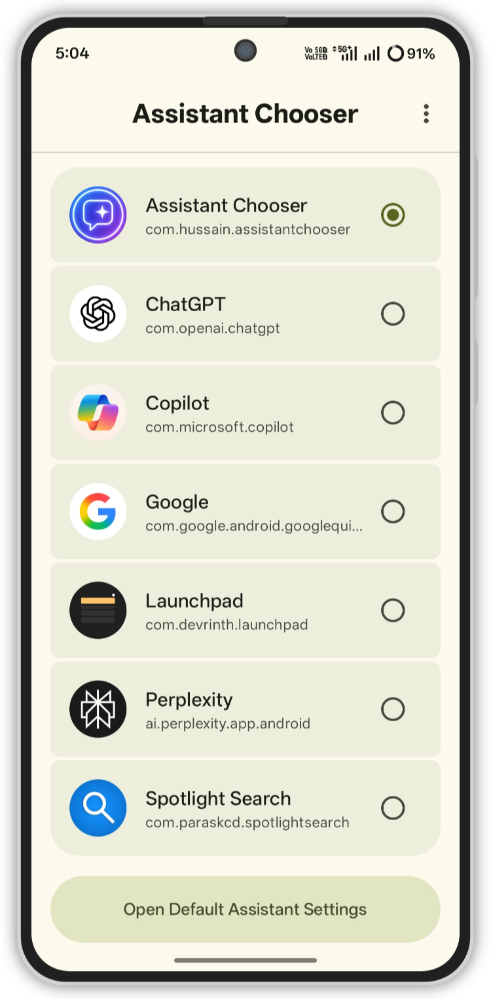

# Assistant Chooser

**Use all your assistant and search apps from one place — set or switch your default assistant faster.**

<p align="center">
  
</p>

<p align="center">
  
</p>

<p align="center">
  <a href="https://github.com/Ayaanh001/Assistant-Chooser/releases">
    
  </a>
  <a href="https://github.com/Ayaanh001/Assistant-Chooser/releases">
    
  </a>
</p>

**Assistant Chooser** lets you view, launch, and switch between all your assistant and search apps — like [Launchpad Search](https://github.com/Ayaanh001/launchpad-search) and [SpotLight Search](https://github.com/Ayaanh001/SpotlightSearch) — directly from a single overlay or the full app. You can also set your **default assistant** faster than digging through system settings.

---

## 📱 How to Use

1. Select **Assistant Chooser** as your default digital assistant in system settings.
2. Open the overlay using any of these methods:
   - **Home button users**: Long press the Home button
   - **Gesture users**: Swipe from the bottom corners
   - **Quick Settings**: Add the tile via the app menu or your notification shade
3. Tap any app's icon or name to launch its voice assistant or open it fully.
4. Tap the 🔘 radio button next to an app to set it as your default assistant. Due to Android restrictions this can't be done programmatically — tapping it opens the system default assistant settings with a prompt to help you switch faster.

---

## 🚀 Features

- 🧭 Quickly navigate to set any app as the **default assistant**
- 🔄 Switch between **Gemini**, **ChatGPT**, **Perplexity**, **Copilot**, and more
- 🎙️ Choose whether tapping an app opens its **voice assistant** or the **full app**
- 📋 **Custom app list** — curate exactly which apps appear in the overlay
- ⚡ **Quick Settings Tile** for instant access without unlocking
- 🎨 **Material You (Material 3)** UI with full dynamic colour support 
- 🌙 Light and dark theme support
- 🧼 Clean, minimal UI focused on speed

---

## 🛠️ Tech Stack & Architecture

- **Language**: 100% [Kotlin](https://kotlinlang.org/)
- **UI**: [Jetpack Compose](https://developer.android.com/jetpack/compose) — fully declarative, no XML layouts
- **Architecture**: Feature-based package structure with ViewModels and StateFlow
- **Min SDK**: Android 8.0 (API 26)

---

## 🚀 Getting Started

### Prerequisites

- Android Studio Hedgehog or later
- JDK 17

### Installation

1. Clone the repo:
   ```sh
   git clone https://github.com/Ayaanh001/Assistant-Chooser.git
   ```
2. Open the project in Android Studio.
3. Let Gradle sync and download dependencies.
4. Run on an emulator or physical device (Android 8.0+).

---

## 📂 Project Structure

```
Assistant-Chooser/
│
├── app/
│   ├── src/main/
│   │   ├── java/com/hussain/assistantchooser/
│   │   │   ├── core/               # Shared data: AppCache, AssistantApp, enums, prefs constants
│   │   │   ├── data/               # App loading (AppLoader) and launching logic (AppLauncher)
│   │   │   ├── main/               # Main screen — MainActivity, MainViewModel, AssistantChooserScreen
│   │   │   ├── overlay/            # Overlay — AssistantOverlayActivity, OverlayViewModel, AssistantOverlayScreen
│   │   │   ├── settings/           # Settings — SettingsActivity, SettingsScreen, SettingsUtils
│   │   │   ├── services/           # QuickLaunchTileService
│   │   │   ├── ui/
│   │   │   │   ├── theme/          # Material You theme, colours, typography
│   │   │   │   └── components/     # Shared composables: GroupSurface, AppIconItem, SkeletonLoader
│   │   │   └── AssistantChooserApplication.kt
│   │   ├── res/                    # Icons, drawables, strings, shortcuts
│   │   └── AndroidManifest.xml
│   └── build.gradle.kts
│
├── assets/                         # App icon and screenshots
└── settings.gradle.kts
```

---

## ⚠️ Known Issues

### Google app does not launch Gemini Assistant

On some devices, tapping the **Google** app does not open Gemini as expected.

**Cause**: Android requires Google to be set as the system default assistant for Gemini to launch correctly via the assistant intent.

**Recommended workaround (if you want Gemini)**:
1. Keep **Google** set as your default digital assistant in system settings.
2. Use the **Quick Settings tile** to open Assistant Chooser whenever you want to switch apps. This gives you fast access without changing the default.

**Alternative**: If you don't need Gemini, set **Assistant Chooser** as the default assistant instead. In this mode, tapping Google will open Google Voice Search rather than Gemini, but all other assistant switching works normally.